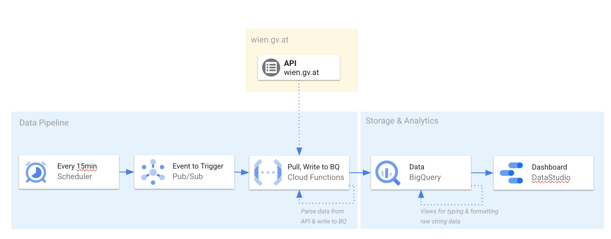

# Wienerluft

## Architecture


## Cost of running on GCP

## Installation
### Resources which will be used
* Cloud Scheduler
* Cloud Storage
* Pub/Sub
* BigQuery 
* Cloud Functions
* Cloud Build


### Preparation
Set `PROJECTID` in `config.sh` to desired GCP project-id.

**Run initialization** (only required once per project) 

This will enable all required services 
```
./init.sh
```

#### Run installation scripts to provision required resources
```
cd resources
./config.sh
./create.sh
``` 
#### Deprovision resources
```
./clean.sh
```


